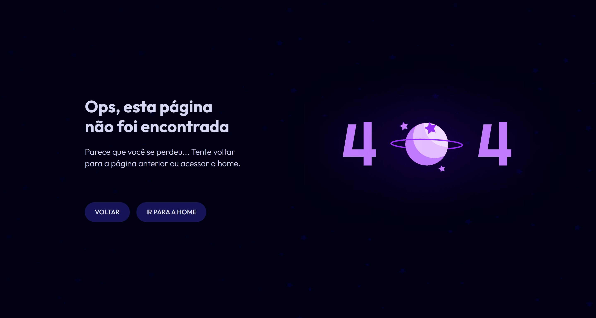

<h1 align="center"> 404 - Not Found Page | BoraCodar#27 </h1>

[Clique aqui para acessar](https://not-found-page-maik-emanoel.vercel.app/)

## 🚀 Tecnologias

Esse projeto foi desenvolvido com as seguintes tecnologias:

- [React.js](https://react.dev/)
- [Tailwind CSS](https://tailwindcss.com/)
- Git and GitHub

## 💻 Projeto

Este projeto é a interface de uma página de erro 404 (página não encontrada) com animação.  

Projeto construído a partir do layout proposto no desafio [#BoraCodar27](https://boracodar.dev/) realizado pela [Rocketseat](https://rocketseat.com.br).
Após o desenvolvimento do projeto inicial, adicionei novas features, tais quais:

- Layout responsivo (Adaptado para telas menores);
- Animação no background;
- Efeitos hover/active;
- Entre outras pequenas modificações.

## 🔖 Layout

Você pode visualizar o layout do projeto proposto através [DESSE LINK](https://www.figma.com/community/file/1258418121860696031). É necessário ter conta no [Figma](https://figma.com) para acessá-lo.